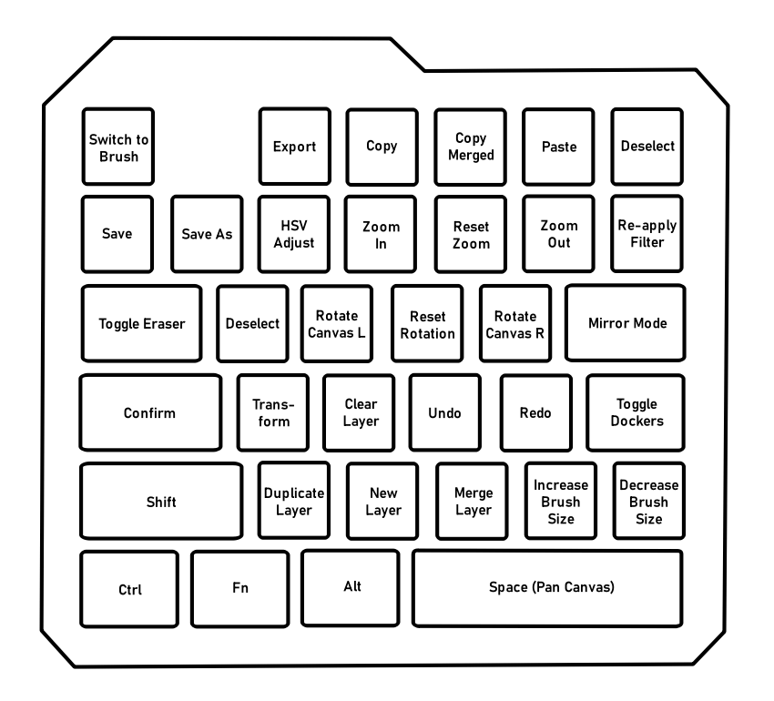

### One Handed AHK Scripts for Krita
AHK scripts for a onehanded keyboard (or just, the left side of a full keyboard). The configurations for some of these functions are arbitrary, so you'll need to import the krita.shortcuts file, or add the shortcuts manually to make the script work correctly:
* Export File: Crtl+Alt+Shift+S
* New Layer: Ctrl+Insert
* Reset Canvas Rotation: Alt+0

Choose from using volume mute (great for if you have an external media knob) or shift+space as the suspension toggle. The script launches in suspension by default.

Your rightmost keys on the end of each row should be (starting from the topmost row): F6, 6, T, G, B, and Space. If not, you'll need to edit the script.
